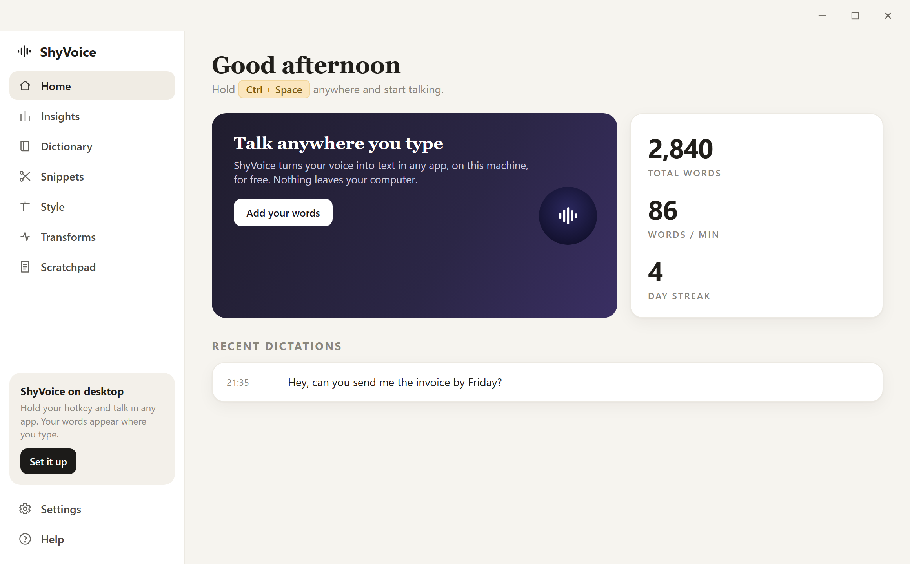

<div align="center">

# 🎙️ GatedVoice

### Free, private voice dictation for Windows. Hold a key, talk, and your words appear in any app.

GatedVoice is a free and open-source alternative to paid dictation apps like Wispr Flow.
Speech-to-text runs **100% on your own machine** with [Whisper](https://github.com/ggerganov/whisper.cpp) —
no account, no subscription, no per-word cost, and nothing ever leaves your computer.

<sub>A **ShyLabs** project.</sub>

[](LICENSE)




</div>

---

## Why GatedVoice?

Good dictation apps cost money and send your voice to their servers. GatedVoice does neither.

- 🆓 **Actually free** — no trial, no subscription, no usage cap. MIT licensed.
- 🔒 **Private by design** — audio is transcribed locally with Whisper and never uploaded. It works with your Wi-Fi off.
- ⌨️ **Works everywhere** — hold a hotkey in *any* app (browser, email, Slack, code editor, Word) and your speech is typed where your cursor is.
- ⚡ **Fast** — the default model loads in about a third of a second and transcribes in near real time.
- 🧠 **Smart** — a custom dictionary that fixes how your names and jargon are spelled, text snippets, usage insights, and optional AI cleanup.
- 🪶 **Tiny footprint** — a single native app that lives in your system tray.

## Install

### Option 1 — Download and run (easiest)

1. Grab the latest **[Release](../../releases/latest)** and download the ZIP for your PC:
   - `GatedVoice-win-x64.zip` — most Windows PCs (Intel / AMD)
   - `GatedVoice-win-arm64.zip` — Windows on ARM (Snapdragon, etc.)
2. Unzip it anywhere and run **`GatedVoice.exe`**.
3. On first launch GatedVoice downloads the speech model once (~148 MB), then a **"GatedVoice is ready"** popup appears.
4. Click into any text box, **hold `Ctrl` + `Space`**, talk, and release. Your words are typed in.

> Windows may show a SmartScreen warning because the app isn't code-signed (signing costs money; this is free).
> Click **More info → Run anyway**.

### Option 2 — Build from source

You need the [.NET 8 SDK](https://dotnet.microsoft.com/download/dotnet/8.0).

```powershell
git clone https://github.com/yzgershon/GatedVoice.git
cd GatedVoice

# run it
dotnet run -c Release

# or build a standalone app for your PC (win-x64 or win-arm64)
dotnet publish -c Release -r win-x64 --self-contained true -o dist
```

## How to use it

| Hotkey | What it does |
|---|---|
| Hold **`Ctrl` + `Space`** | Dictate. Speak while held, release to insert the text. |
| Hold **`Alt` + `Space`** | Dictate **and** clean it up with AI (see [Transforms](#ai-transforms)). |

Both are push-to-talk — text lands the instant you let go. Everything else lives in the **tray icon** (bottom-right of your taskbar): enable/disable, insights, launch-at-login, and quick access to your settings.

## Features

- **Custom dictionary** — teach GatedVoice to spell names and jargon right. It hints Whisper toward your spelling *and* fixes common mishears.
- **Snippets** — say a trigger phrase, get a saved block of text (your email, a signature, a link).
- **Insights** — total words, average WPM, words per day, and a daily streak.
- **Style controls** — trailing spaces, filler-word removal ("um", "uh"), paste vs. type.
- <a id="ai-transforms"></a>**AI Transforms (optional)** — `Alt + Space` runs your dictation through an LLM to fix grammar and punctuation while keeping your voice. Use **[Ollama](https://ollama.com) locally for free**, or plug in an Anthropic/OpenAI key. Off by default.
- **Rebindable hotkeys**, swappable Whisper models (base → small → medium for more accuracy), and a built-in scratchpad.

## Privacy

Your voice is turned into text **on your device** by Whisper. No audio and no transcripts are ever sent anywhere — the only network request GatedVoice ever makes on its own is the one-time model download on first run (and optional cloud AI, only if *you* turn it on and add a key). Your settings and history live in a local folder (`%APPDATA%\GatedVoice`) that only you can see.

## How it works

| Piece | Tech |
|---|---|
| Speech-to-text | [Whisper.net](https://github.com/sandrohanea/whisper.net) (whisper.cpp), native, offline |
| Audio capture | [NAudio](https://github.com/naudio/NAudio) (WASAPI microphone) |
| System-wide hotkey + text insertion | Low-level keyboard hook + clipboard paste |
| App + UI | C# / WinForms + WebView2 dashboard (.NET 8) |

Built for **Windows on x64 and ARM64**, running natively on both.

## Contributing

Issues and pull requests are welcome. GatedVoice started as a personal project to avoid paying for dictation — if it's useful to you, a ⭐ helps other people find it.

## License

[MIT](LICENSE) — free to use, modify, and share.

Whisper models are © their respective authors and downloaded from [Hugging Face](https://huggingface.co/ggerganov/whisper.cpp) on first run.

<div align="center"><sub>Part of <b>ShyLabs</b> — tools built by <a href="https://github.com/yzgershon">@yzgershon</a>.</sub></div>
